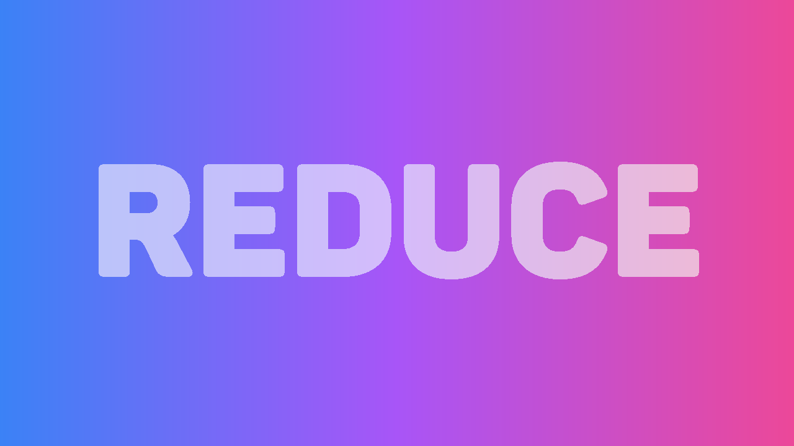

# Reduce

Reduce is a URL shortening service that allows users to easily shorten long URLs for easy access and sharing. This repository contains both the backend and frontend code for the Reduce application.

## Features

- URL shortening: Convert long URLs into short, easy-to-share URLs.
- Automatic URL retrieval: Easily retrieve the original long URL using the short URL.
- Unique ID generation: Each shortened URL is given a unique, randomly generated ID.
- Responsive UI: User-friendly interface with React, Tailwind CSS, and MUI components.

## Technologies Used

- **Backend**: Go, Echo, GORM
- **Frontend**: React, Axios, Tailwind CSS, MUI
- **Database**: PostgreSQL
- **Containerization**: Docker, Docker Compose

## Getting Started

### Prerequisites

- Docker and Docker Compose installed
- Node.js and npm installed

### Backend Setup

1. Ensure the environment variables are set:

   ```
   DB_HOST=host
   DB_PORT=port
   DB_USER=user
   DB_NAME=name
   DB_PASSWORD=password
   BASE_URL=url
   ```

2. Build and run the backend using Docker Compose:
   ```sh
   docker-compose up --build
   ```

### Frontend Setup

1. Navigate to the frontend directory:

   ```sh
   cd frontend
   ```

2. Create a `.env.local` file with the following variable:

   ```
   NEXT_PUBLIC_BACKEND_URL=http://localhost:8080
   ```

3. Install the dependencies and run the frontend:
   ```sh
   npm install
   npm run dev
   ```

## Usage

1. Open your browser and navigate to `http://localhost:3000`.
2. Enter the long URL you want to shorten and click the "Reduce" button.
3. Copy the shortened URL and share it as needed.

## Contributing

Thank you for considering contributing to Reduce! We welcome your contributions. Whether it's fixing bugs, adding features, or improving documentation, your help is appreciated. Feel free to report issues or submit pull requests.

## License

This project is licensed under the MIT License. See the [LICENSE](LICENSE) file for more details.
